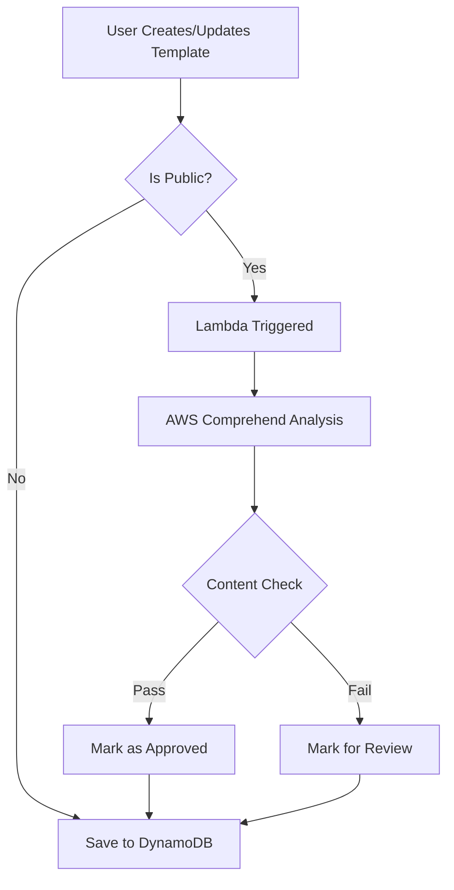

# Content Moderation for GravyPrompts

## Overview

This document outlines the content moderation strategy for public templates using AWS Comprehend and related services.

## AWS Comprehend Integration

### Services Used

1. **AWS Comprehend** - For content analysis
   - Sentiment Analysis
   - Toxicity Detection
   - PII (Personally Identifiable Information) Detection

2. **AWS Lambda** - For moderation processing
   - Triggered on template creation/update
   - Processes content through Comprehend
   - Updates moderation status in DynamoDB

### Cost Analysis

#### AWS Comprehend Pricing (US East 1)
- **Sentiment Analysis**: $0.0001 per unit (100 characters)
- **Toxicity Detection**: $0.0001 per unit (100 characters)
- **PII Detection**: $0.0001 per unit (100 characters)

#### Example Cost Calculation
For a typical template (500 characters):
- 5 units × $0.0001 × 3 analyses = $0.0015 per template
- 1,000 templates/month = $1.50
- 10,000 templates/month = $15.00
- 100,000 templates/month = $150.00

#### Additional Costs
- **Lambda Invocations**: $0.20 per 1M requests
- **Lambda Compute**: ~$0.00001667 per invocation (128MB, 1s duration)
- **DynamoDB Updates**: Minimal (within free tier for most usage)

### Moderation Workflow



### Moderation Criteria

#### Automatic Rejection
- **Toxicity Score** > 0.7 (HIGH confidence)
- **Negative Sentiment** > 0.9 with toxicity
- **PII Detection** of sensitive data (SSN, credit cards)

#### Manual Review Required
- **Toxicity Score** between 0.5-0.7 (MEDIUM confidence)
- **Multiple PII Detections** (emails, phone numbers)
- **Negative Sentiment** > 0.8

#### Automatic Approval
- **Toxicity Score** < 0.5
- **No PII** or only non-sensitive PII
- **Neutral or Positive Sentiment**

### Implementation Details

#### Lambda Function
```javascript
const comprehend = new AWS.Comprehend();

async function moderateContent(templateContent) {
  // Remove HTML tags for analysis
  const plainText = stripHtml(templateContent);
  
  // Run analyses in parallel
  const [sentiment, toxicity, pii] = await Promise.all([
    comprehend.detectSentiment({ Text: plainText, LanguageCode: 'en' }).promise(),
    comprehend.detectToxicContent({ Text: plainText, LanguageCode: 'en' }).promise(),
    comprehend.detectPiiEntities({ Text: plainText, LanguageCode: 'en' }).promise()
  ]);
  
  return {
    sentiment: sentiment.Sentiment,
    sentimentScores: sentiment.SentimentScore,
    toxicity: toxicity.ResultList[0]?.Labels || [],
    piiEntities: pii.Entities || [],
    moderationStatus: determineModerationStatus(sentiment, toxicity, pii)
  };
}
```

#### DynamoDB Schema Addition
```javascript
{
  moderationStatus: 'pending' | 'approved' | 'rejected' | 'review',
  moderationDetails: {
    sentiment: 'POSITIVE' | 'NEGATIVE' | 'NEUTRAL' | 'MIXED',
    sentimentScores: { Positive, Negative, Neutral, Mixed },
    toxicityLabels: ['PROFANITY', 'HATE_SPEECH', etc],
    piiDetected: ['EMAIL', 'PHONE', etc],
    moderatedAt: timestamp,
    moderationVersion: '1.0'
  }
}
```

### Rate Limiting Strategy

#### API Gateway Throttling
- **Per User**: 10 templates per minute, 100 per hour
- **Global**: 1000 templates per minute
- **Burst**: Allow 2x rate for 10 seconds

#### DynamoDB Limits
- **Write Capacity**: Auto-scaling 5-100 WCU
- **Read Capacity**: Auto-scaling 5-500 RCU

### Security Considerations

1. **Content Sanitization**
   - Strip potentially harmful HTML/JavaScript
   - Validate variable syntax
   - Limit template size (10KB max)

2. **User Reputation System** (Future TODO)
   - Track user's approved/rejected ratio
   - Adjust rate limits based on reputation
   - Fast-track trusted users

3. **Appeal Process** (Future TODO)
   - Allow users to appeal rejections
   - Manual review queue
   - Feedback mechanism

### Monitoring and Alerts

#### CloudWatch Metrics
- Moderation rejection rate
- Average processing time
- API throttling events
- Comprehend API errors

#### SNS Alerts
- High rejection rate (>20%)
- Comprehend API failures
- Rate limit breaches
- Unusual activity patterns

### Cost Optimization

1. **Caching Results**
   - Cache moderation results for 24 hours
   - Skip re-moderation for unchanged content

2. **Batch Processing**
   - Group multiple templates for bulk analysis
   - Use Comprehend batch APIs when available

3. **Smart Sampling**
   - Only analyze changed portions on updates
   - Skip moderation for trusted users (future)

### Compliance and Privacy

1. **Data Retention**
   - Moderation logs kept for 90 days
   - PII detection results not stored
   - User content never shared with third parties

2. **GDPR Compliance**
   - Users can request moderation data
   - Right to explanation for rejections
   - Data deletion upon account closure

### Future Enhancements (TODO.md items)

1. **Multi-language Support**
   - Expand beyond English
   - Language-specific moderation rules

2. **Custom Moderation Models**
   - Train on GravyPrompts-specific content
   - Industry-specific filters

3. **Community Reporting**
   - User flagging system
   - Crowd-sourced moderation

4. **AI-Powered Suggestions**
   - Suggest improvements for rejected content
   - Help users create compliant templates

## Implementation Checklist

- [ ] Create Lambda function for moderation
- [ ] Set up Comprehend permissions
- [ ] Configure DynamoDB GSIs for moderation queries
- [ ] Implement API Gateway rate limiting
- [ ] Create CloudWatch dashboard
- [ ] Set up SNS alerts
- [ ] Add moderation status to UI
- [ ] Create moderation admin panel (future)

## Estimated Monthly Costs

### Low Usage (1,000 templates/month)
- Comprehend: $1.50
- Lambda: $0.20
- Total: **~$2/month**

### Medium Usage (10,000 templates/month)
- Comprehend: $15.00
- Lambda: $2.00
- Total: **~$17/month**

### High Usage (100,000 templates/month)
- Comprehend: $150.00
- Lambda: $20.00
- CloudWatch Logs: $5.00
- Total: **~$175/month**

Note: These are rough estimates. Actual costs may vary based on template length and complexity.