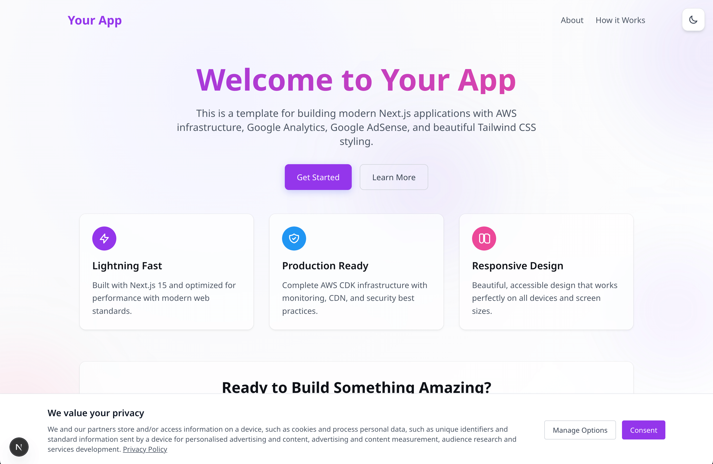

# Gravy Prompts

Store, share, populate, and rate your AI prompt templates. The ultimate prompt management platform for AI enthusiasts and professionals.

## Features

### 🚀 Modern Tech Stack

- **Next.js 15** with App Router
- **TypeScript** for type safety
- **Tailwind CSS** for rapid UI development
- **ESLint** for code quality

### 🔧 Google Integrations

- **Google Analytics** with consent management
- **Google AdSense** with privacy-compliant setup
- **Cookie Consent Management Platform (CMP)**

### ☁️ AWS Infrastructure

- **Complete CDK setup** with multiple stacks
- **CloudFront CDN** for global content delivery
- **S3** for static hosting
- **Certificate Manager** for SSL
- **WAF** for security
- **Lambda@Edge** for edge functions
- **CloudWatch** monitoring and alerts

### 🎨 UI/UX Features

- **Dark/Light theme** toggle
- **Responsive design** for all devices
- **Beautiful gradient backgrounds** with animated orbs
- **Glass morphism** design elements
- **Accessible** and SEO optimized

## 🖼️ Preview

<div align="center">
  <table>
    <tr>
      <td align="center">
        
        <br />
        <em>Light Mode</em>
      </td>
      <td align="center">
        
        <br />
        <em>Dark Mode</em>
      </td>
    </tr>
  </table>
</div>

> **💡 Making this a GitHub Template Repository**
> 
> If you're the repository owner and want to make this a template for others to use:
> 1. Go to your repository **Settings**
> 2. Scroll down to the **"Template repository"** section
> 3. Check the box **"Template repository"**
> 4. This will add a **"Use this template"** button for others to easily create new repositories

## Quick Start

### 1. Create Your New Repository

Choose one of these methods to get started with the template:

#### Method A: Use GitHub Template (Recommended)

1. Click the **"Use this template"** button at the top of this repository
2. Choose **"Create a new repository"**
3. Name your repository and set visibility
4. Clone your new repository:

```bash
git clone https://github.com/yourusername/your-new-repo-name.git
cd your-new-repo-name
```

#### Method B: Manual Copy

If you prefer to copy the files manually:

```bash
# Clone this template
git clone https://github.com/original-repo/nextjs-aws-template.git your-project-name
cd your-project-name

# Remove the original git history and create a new repository
rm -rf .git
git init
git add .
git commit -m "Initial commit from NextJS AWS Template"

# Connect to your new GitHub repository
git remote add origin https://github.com/yourusername/your-new-repo-name.git
git branch -M main
git push -u origin main
```

### 2. Install Dependencies

```bash
# Install Next.js dependencies
npm install

# Install CDK dependencies
npm run cdk:install

# Copy environment file
cp .env.example .env
```

### 3. Configure Environment Variables

Edit `.env` with your values:

```bash
# Google Analytics
NEXT_PUBLIC_GA_MEASUREMENT_ID=G-XXXXXXXXXX

# Google AdSense
NEXT_PUBLIC_ADSENSE_CLIENT_ID=ca-pub-XXXXXXXXXXXXXXXXX

# AWS Configuration
AWS_REGION=us-east-1
AWS_ACCOUNT_ID=123456789012
DOMAIN_NAME=yourdomain.com

# Application
APP_NAME=your-app-name
```

### 4. Configure Template Names

This template uses configurable naming conventions. Update these key areas:

#### Environment Variables (`.env`)

```bash
# Application Identity
APP_NAME=my-awesome-app              # Used for branding and stack naming
DOMAIN_NAME=myapp.com               # Your domain (without www)
STACK_PREFIX=MYAPP                  # AWS stack prefix (optional, defaults to uppercase APP_NAME)

# AWS Stack Names Generated:
# MYAPP-Foundation, MYAPP-Certificate, MYAPP-EdgeFunctions, 
# MYAPP-WAF, MYAPP-CDN, MYAPP-App, MYAPP-Monitoring
```

#### Required File Updates

**1. Update Package Information (`package.json`)**

```json
{
  "name": "my-awesome-app",
  "description": "Description of my awesome application"
}
```

**2. Update Site Metadata (`app/layout.tsx`)**

```typescript
export const metadata: Metadata = {
  title: "My Awesome App | Professional Description",
  description: "Description of my awesome application and what it does for users.",
  // ... update all metadata fields
};
```

**3. Update Schema Markup (`app/layout.tsx`)**

```json
{
  "@type": "WebApplication", 
  "name": "My Awesome App",
  "description": "Description of my application and its purpose.",
  "url": "https://myapp.com"
}
```

**4. Update Public Files**

- `public/robots.txt`: Update sitemap URL to your domain
- `public/ads.txt`: Add your Google AdSense publisher ID

### 5. Start Development

```bash
# Start development server
npm run dev

# Open http://localhost:3000
```

## Customization Guide

### 🎨 Brand Colors

Update your brand colors in `app/globals.css`:

```css
:root {
  --primary: #9436eb;      /* Your primary brand color */
  --secondary: #2196f3;    /* Your secondary brand color */
  --accent: #ec4899;       /* Your accent brand color */
  --neutral: #9ca3af;      /* Your neutral brand color */
}
```

Also update `tailwind.config.ts`:

```typescript
theme: {
  extend: {
    colors: {
      primary: "#9436eb",
      secondary: "#2196f3", 
      accent: "#ec4899",
      neutral: "#9ca3af",
    },
  },
},
```

### 📝 Content Updates

#### App Metadata

Update `app/layout.tsx`:
- Title and description
- Open Graph metadata
- Schema markup
- Keywords

#### Page Content

- `app/page.tsx` - Home page
- `app/about/page.tsx` - About page
- `app/how-it-works/page.tsx` - Documentation
- `app/privacy/page.tsx` - Privacy policy
- `app/terms/page.tsx` - Terms of service

#### Package Information

Update `package.json`:
```json
{
  "name": "your-app-name",
  "description": "Your app description"
}
```

### 🔧 Google Services Setup

#### Google Analytics

1. Create a GA4 property at [analytics.google.com](https://analytics.google.com)
2. Copy your Measurement ID (G-XXXXXXXXXX)
3. Update `NEXT_PUBLIC_GA_MEASUREMENT_ID` in `.env`

#### Google AdSense

1. Apply for AdSense at [adsense.google.com](https://adsense.google.com)
2. Get your Publisher ID (ca-pub-XXXXXXXXXXXXXXXXX)
3. Update `NEXT_PUBLIC_ADSENSE_CLIENT_ID` in `.env`
4. Update `public/ads.txt` with your Publisher ID

## AWS Deployment

Deploy your Next.js application to AWS with enterprise-grade infrastructure including CloudFront CDN, S3 storage, SSL certificates, and security features.

### Prerequisites

1. **AWS Account** with appropriate permissions
2. **AWS CLI** configured:
   ```bash
   # For standard credentials
   aws configure
   
   # For AWS SSO (recommended)
   aws sso login --profile your-profile-name
   # Then add to .env: AWS_PROFILE=your-profile-name
   ```
3. **Node.js** 18.x or later
4. **Domain** registered (for production deployment)

### 🚀 Quick Deployment (3 Steps)

#### Step 1: Configure Environment
```bash
# Copy and configure environment
cp .env.example .env

# Edit .env and add:
# - AWS_PROFILE=your-profile-name (if using SSO)
# - AWS_ACCOUNT_ID=123456789012
# - DOMAIN_NAME=yourdomain.com
# - APP_NAME=your-app-name

# Install CDK dependencies (one time only)
npm run cdk:install
```

#### Step 2: Deploy Certificate First (if using custom domain)
```bash
# Deploy certificate and save ARN to .env
npm run deploy:cert:first

# The script will:
# 1. Check if a certificate already exists
# 2. Create a new one if needed
# 3. Save the ARN to your .env file automatically
# 4. Show DNS validation records

# Check validation status
npm run check:cert

# Wait for "Certificate is validated and ready!" message
```

**Certificate Validation Steps:**
1. Copy the CNAME records shown after deployment
2. Add them to your DNS provider (both www and non-www)
3. Wait 5-30 minutes for DNS propagation
4. Run `npm run check:cert` to monitor validation
5. Certificate must show "ISSUED" before proceeding

**Important:** The certificate ARN is automatically saved to your `.env` file. This prevents accidental deletion during future deployments.

#### Step 3: Deploy Everything Else
```bash
# Once certificate is validated (or if skipping custom domain)
npm run deploy:all -- -c notificationEmail=your-email@example.com
```

**Note:** The deployment will:
- Ask if you want to use custom domain or CloudFront URL only
- Check certificate validation status automatically
- Output your CloudFront distribution URL for DNS setup

### 📍 DNS Configuration (Post-Deployment)

After deployment completes successfully:

1. **Note the CloudFront URL** from deployment output (e.g., `d1234abcd.cloudfront.net`)

2. **Configure your DNS records:**

   **Option A - Using Route 53:**
   ```
   Type: A Record (ALIAS)
   Name: yourdomain.com
   Value: d1234abcd.cloudfront.net (your CloudFront distribution)
   
   Type: A Record (ALIAS) 
   Name: www.yourdomain.com
   Value: d1234abcd.cloudfront.net (your CloudFront distribution)
   ```

   **Option B - Other DNS Providers:**
   ```
   Type: CNAME
   Name: www
   Value: d1234abcd.cloudfront.net
   
   Type: CNAME or ALIAS (if supported)
   Name: @ (or blank)
   Value: d1234abcd.cloudfront.net
   ```

3. **Wait for DNS propagation** (15 minutes to 2 hours)

### ✅ Post-Deployment Checklist

- [ ] Certificate shows "Issued" for BOTH domains in ACM
- [ ] CloudFront distribution status is "Deployed"
- [ ] DNS records added (both www and non-www)
- [ ] Site loads at `https://www.yourdomain.com` (after propagation)
- [ ] Non-www redirects to www automatically
- [ ] HTTP redirects to HTTPS automatically
- [ ] Email confirmation received for billing alerts

### Infrastructure Overview

Your deployment creates these AWS resources:

| Stack | Purpose | Resources |
|-------|---------|-----------|
| **Foundation** | Core infrastructure | S3 buckets for content and logs |
| **Certificate** | SSL/TLS | ACM certificate (create once, never delete) |
| **Edge Functions** | URL handling | CloudFront functions for redirects |
| **WAF** | Security | Rate limiting, geo-blocking |
| **CDN** | Content delivery | CloudFront distribution |
| **App** | Website content | Static files deployment |
| **Monitoring** | Observability | CloudWatch dashboards, billing alerts |

**Key Features:**
- Automatic S3 bucket policy configuration (no manual fixes needed!)
- All traffic redirects to `https://www.yourdomain.com`
- Enterprise security headers and WAF protection
- Automatic billing alerts at $10, $50, and $100

### Common Commands

```bash
# Update website content only
npm run build && npm run deploy:app

# Update infrastructure
npm run deploy:all

# Check deployment status
npm run status:all

# Enable maintenance mode
npm run maintenance:on
# ... do maintenance work ...
npm run maintenance:off
```

### 💰 Cost Estimates

For a low-traffic site, expect ~$6-10/month:
- **S3**: ~$0.023/GB/month
- **CloudFront**: ~$0.085/GB data transfer  
- **WAF**: ~$5/month + $0.60/million requests
- **Route 53**: ~$0.50/month (if used)

### 🚨 Troubleshooting

#### "403 Forbidden" Error
**This is NORMAL!** CloudFront takes 15-20 minutes to propagate globally. 
- Wait 15-20 minutes after deployment completes
- Verify DNS points to CloudFront (NOT to S3 directly)
- Clear browser cache and try again
- Check S3 has content: `aws s3 ls s3://yourdomain.com-app/`

#### Certificate Not Validating
- Ensure you added BOTH CNAME records (www and non-www)
- Records must be added exactly as shown in ACM
- Check with: `dig _abc123.yourdomain.com CNAME`
- Both domains must show "Issued" status

#### DNS Not Working
- Verify CloudFront distribution is "Deployed" status
- DNS propagation can take up to 2 hours
- Test CloudFront directly: `https://d1234abcd.cloudfront.net`
- Some DNS providers don't support ALIAS for root domain - use www subdomain

#### Build Errors
```bash
# Clear caches and rebuild
rm -rf .next out node_modules
npm install
npm run build

# CDK TypeScript errors
cd cdk && rm -rf lib/*.js lib/*.d.ts && npm run build
```

### 🗑️ Complete Cleanup / Deletion

To completely remove all AWS resources and stop all charges:

```bash
npm run destroy:all
```

This will:
- Delete all 7 CloudFormation stacks in the correct order
- Empty and delete S3 buckets (website and logs)
- Remove CloudFront distribution (takes 15-20 minutes)
- Remove WAF, monitoring, and all other resources
- Optionally preserve your SSL certificate for future use

**Note:** You must manually remove DNS records pointing to CloudFront.

### 📚 Complete Deployment Guide

For advanced topics including:
- Individual stack deployment
- Using existing certificates
- Complete redeployment procedures
- Monitoring and logs setup
- Security configuration details
- Custom domain configurations

**See the [Complete Deployment Guide](docs/DEPLOYMENT.md)**

### 🔐 Certificate Management Best Practices

**First-Time Deployment:**
1. Always deploy certificate separately first: `npm run deploy:cert`
2. Complete DNS validation before deploying other stacks
3. Save the certificate ARN after validation for future use

**Reusing Certificates:**
After certificate is validated, save the ARN to `cdk/cdk.json`:
```json
{
  "context": {
    "certificateArn": "arn:aws:acm:us-east-1:123456789012:certificate/abc-def-ghi"
  }
}
```

This prevents recreating certificates and avoids validation delays.

**See [First Deployment Guide](FIRST_DEPLOYMENT.md) for detailed certificate handling**

## Development Scripts

| Command | Description |
|---------|-------------|
| `npm run dev` | Start development server with Turbopack |
| `npm run build` | Build for production |
| `npm run start` | Start production server |
| `npm run lint` | Run ESLint |
| `npm run build:cdk` | Build CDK TypeScript (done automatically during deploy) |
| `npm run cdk:synth` | Synthesize CDK templates |
| `npm run status` | Check stack status |

## File Structure

```
├── app/                    # Next.js App Router pages
│   ├── globals.css        # Global styles
│   ├── layout.tsx         # Root layout
│   ├── page.tsx           # Home page
│   ├── about/             # About page
│   ├── how-it-works/      # Documentation
│   ├── privacy/           # Privacy policy
│   └── terms/             # Terms of service
├── components/            # Reusable React components
│   ├── AdSense/           # Google AdSense components
│   ├── GoogleAnalytics.tsx
│   ├── GoogleCMP.tsx      # Cookie consent
│   └── ThemeToggle.tsx
├── cdk/                   # AWS CDK infrastructure
│   ├── src/               # CDK stack definitions
│   └── package.json       # CDK dependencies
├── scripts/               # Deployment scripts
├── public/                # Static assets
└── .env.example           # Environment variables template
```

## Best Practices

### 🔒 Security
- All secrets in environment variables
- WAF protection enabled
- HTTPS enforced
- Content Security Policy headers

### 📊 Performance
- Next.js optimizations enabled
- CDN caching configured
- Image optimization
- Bundle analysis available

### ♿ Accessibility
- Semantic HTML structure
- ARIA labels where needed
- Keyboard navigation support
- Color contrast compliance

### 🔍 SEO
- Meta tags optimized
- Structured data markup
- Sitemap included
- robots.txt configured

## Monitoring & Maintenance

### CloudWatch Dashboards

Access monitoring dashboards in AWS Console:
- Application performance metrics
- Error tracking and alerts
- Infrastructure health monitoring

### Maintenance Mode

```bash
# Enable maintenance mode
npm run maintenance:on

# Disable maintenance mode
npm run maintenance:off
```

### Log Monitoring
- CloudFront access logs
- Lambda@Edge function logs
- Application error tracking

## Troubleshooting

### Common Deployment Issues

**403 Forbidden After Deployment**
- This is normal! CloudFront takes 15-20 minutes to propagate globally
- The S3 bucket policy is automatically configured during CDN deployment
- Verify DNS records point to CloudFront distribution (not S3 directly)
- Check S3 bucket has index.html: `aws s3 ls s3://your-bucket-name/`
- Clear browser cache or test in incognito mode

**Certificate Validation Issues**
- Ensure certificate is in us-east-1 region
- Verify BOTH www and non-www validation records are added
- Check validation: `dig _prefix.yourdomain.com CNAME +short`
- Both domains must show "Issued" status in ACM

**Stack Stuck in UPDATE_IN_PROGRESS**
- Run `npm run status:all` to check status
- Wait for completion (can take 30+ minutes for some stacks)
- If truly stuck, check CloudFormation console for rollback

**Build and Development Errors**

```bash
# Clear Next.js cache
rm -rf .next

# Reinstall dependencies
rm -rf node_modules package-lock.json
npm install

# CDK TypeScript errors
cd cdk && rm -f lib/*.d.ts && npm run build
```

**AWS Credential Issues**

```bash
# Verify credentials
aws sts get-caller-identity

# For SSO users
aws sso login --profile your-profile-name

# Bootstrap CDK (first time per account/region)
npx cdk bootstrap
```

### Getting Help

1. Check AWS CloudFormation console for detailed error messages
2. Review deployment outputs for CloudFront domain and other resources
3. Monitor CloudWatch logs for runtime issues
4. Use `npm run diagnose:stack` for specific stack troubleshooting

## Contributing

1. Fork the repository
2. Create a feature branch
3. Make your changes
4. Test thoroughly
5. Submit a pull request

## License

[Your License Here]

## Support

For support, please contact [your-email@example.com] or create an issue in the repository.

---

## Next Steps

After setting up your template:

1. **Customize branding** - Update colors, fonts, and content
2. **Configure domains** - Set up your production domain
3. **Deploy infrastructure** - Run the CDK deployment
4. **Set up monitoring** - Configure alerts and dashboards
5. **Launch your app** - Go live with confidence!

Happy building! 🚀